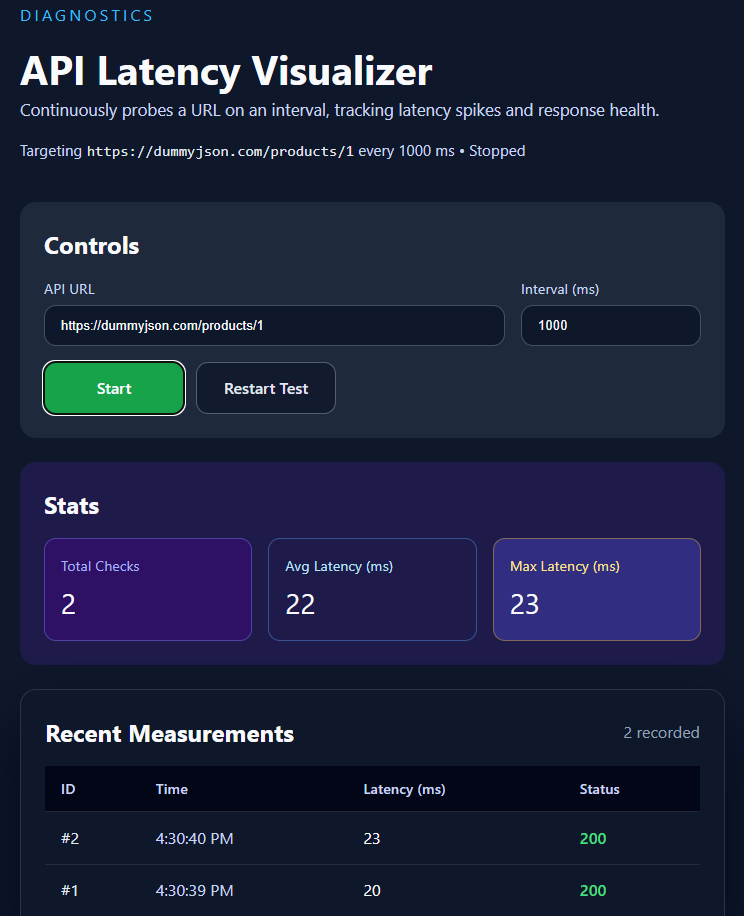

# API Latency Visualizer

API Latency Visualizer is a lightweight React + TypeScript dashboard that continually pings any HTTP endpoint you provide, measures response latency with `performance.now()`, and surfaces the results in real time. It is ideal for diagnosing flaky APIs, validating SLAs, or showcasing endpoint performance during demos.

## 🎯 Purpose

Teams often need a zero-setup way to spot-check how an API behaves over time. This project fills that gap: specify a URL and interval, click **Start**, and immediately see latency stats, status codes, and recent measurements directly in the browser—no backend or databases required.

## ✨ Features

- 🔗 Configure target API URL and polling interval (≥ 500 ms)
- ▶️ Start/Stop polling with a live “Running…” badge
- ♻️ Restart Test button clears history and resets IDs
- 📊 Real-time stats: total checks, average latency, and max latency
- 🧾 Measurement table with ID, local time, latency, and color-coded HTTP status (including error state)
- 🌓 Dark-themed, responsive layout (stacked controls/cards + scrollable table on mobile)
- 🐞 Optional console helper: call `runLatencyCheck()` manually for ad-hoc pings

## 🧱 Folder Structure

```
api-latency-visualizer/
├── public/
├── src/
│   ├── App.tsx        # Main UI + polling logic
│   ├── index.css      # Global + responsive styles
│   ├── App.css        # Vite starter styles (kept for reference)
│   └── main.tsx       # React entry point
├── package.json
└── README.md
```

## 🛠 Tech Stack

- React 18 with hooks (`useState`, `useEffect`, `useRef`)
- TypeScript for strict typing
- Vite for dev/build tooling
- Fetch API + `performance.now()` for latency measurement

## 🚀 How to Run

```bash
# Install dependencies
npm install

# Start the Vite dev server (defaults to http://localhost:5173)
npm run dev
```

Adjust the URL and interval, click **Start**, and the dashboard will begin logging measurements instantly—all in the browser.

## 🔭 Future Improvements

- Persist measurement history (local storage or backend) for long-running tests
- Add charts or sparklines to visualize latency trends
- Support custom headers/auth tokens for secured endpoints
- Export measurements as CSV/JSON
- Add alerting when latency exceeds a configurable threshold

---

API Latency Visualizer delivers a clear, responsive view into API performance with zero setup. Contributions, bug reports, and feature ideas are welcome! 🧑‍💻

<p align="center">
  
</p>

<p align="center">
  <em>A live snapshot of the API Latency Visualizer dashboard.<br/>
  Real-time measurements, statistics, and a responsive interface designed for clarity and speed.</em>
</p>

